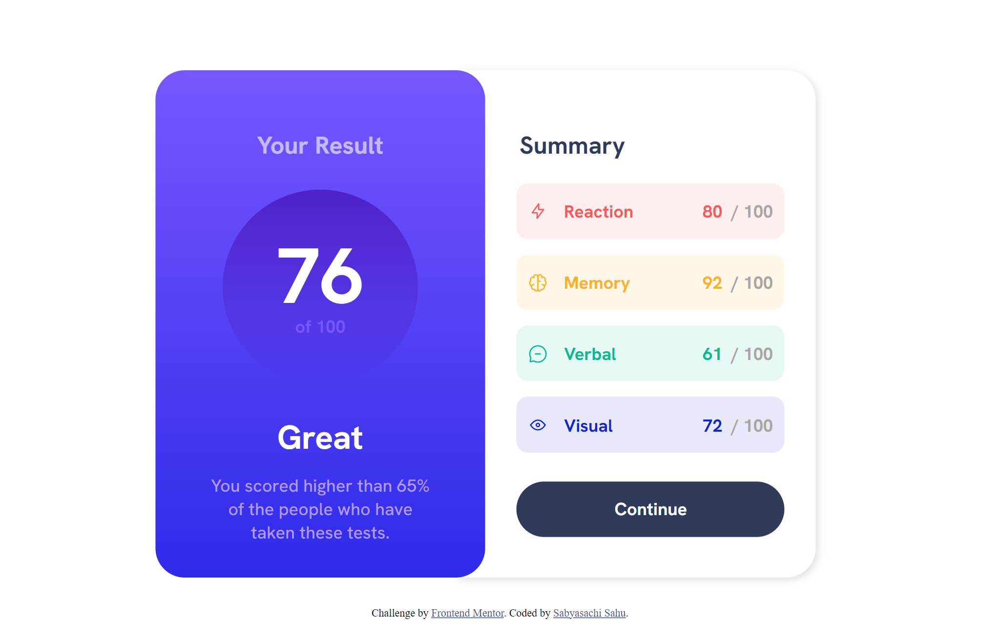
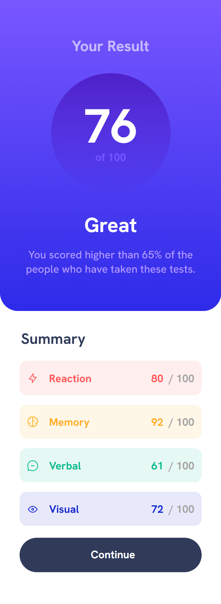

# Frontend Mentor - Results summary component solution

This is a solution to the [Results summary component challenge on Frontend Mentor](https://www.frontendmentor.io/challenges/results-summary-component-CE_K6s0maV). Frontend Mentor challenges help you improve your coding skills by building realistic projects. 

## Table of contents

- [Overview](#overview)
  - [The challenge](#the-challenge)
  - [Screenshot](#screenshot)
  - [Links](#links)
- [My process](#my-process)
  - [Built with](#built-with)
  - [What I learned](#what-i-learned)
  - [Continued development](#continued-development)
  - [Useful resources](#useful-resources)
- [Author](#author)

## Overview

### The challenge

Users should be able to:

- View the optimal layout for the interface depending on their device's screen size
- See hover and focus states for all interactive elements on the page

### Screenshot





### Links

- Solution URL: [GitHub Repo Link](https://github.com/sahuSabya/RESULTS-SUMMARY-COMPONENT-MAIN)
- Live Site URL: [Deployment on GitHub Pages](https://sahusabya.github.io/RESULTS-SUMMARY-COMPONENT-MAIN/)

## My process

### Built with

- Semantic HTML5 markup
- CSS custom properties
- Flexbox
- Laptop-first workflow

### What I learned

I've learnt applying various flexbox properties, CSS postioning, and linear gradients by doing this challenge.
To see, this is how I added code snippets, see below:

```css
.proud-of-this-css {
  display: flex;
  flex-flow: row nowrap;
  background-image: linear-gradient(to bottom, hsl(252, 100%, 67%), hsl(241, 81%, 54%));
}
```

### Continued development

Areas that I want to continue focussing on in future projects:
- CSS Positioning
- CSS Flexbox

### Useful resources

- [WEBDEV CSS Docs 1](https://www.w3schools.com/css/) - This helped me for various CSS properties.
- [Flexbox](https://css-tricks.com/snippets/css/a-guide-to-flexbox/) - This is an amazing article which helped me understand flexbox. I'd recommend it to anyone still learning this concept.

## Author

- Website - [Sabyasachi Sahu](https://sahusabya.github.io/RESULTS-SUMMARY-COMPONENT-MAIN/)
- Frontend Mentor - [@sahuSabya](https://www.frontendmentor.io/profile/sahuSabya)
- Twitter - [@sabyasa34553553](https://www.twitter.com/sabyasa34553553)